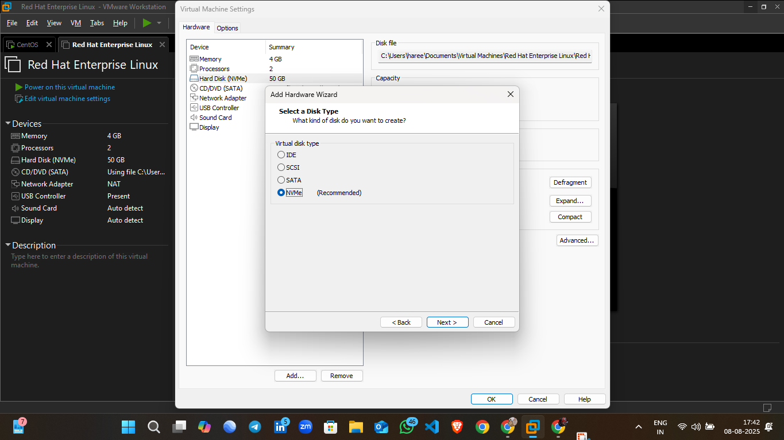

# 🚀 LVM Setup on VirtualBox (RHEL Linux)

[]()
[]()

---

## 📋 Table of Contents
- [About This Task](#about-this-task)
- [Step 1 – Add New Hard Disk in VirtualBox](#step-1--add-new-hard-disk-in-virtualbox)
- [📸 Screenshots & GIF](#-screenshots--gif)
- [Next Steps](#next-steps)

---

## 📖 About This Task
This is the **first step** in setting up **LVM** on a RHEL Linux VM.  
Here, we will add a **new virtual hard disk** in VirtualBox which will later be used to create a Physical Volume (PV) for LVM.

---

## 🛠️ Step 1 – Add New Hard Disk in VirtualBox

1. **Open VirtualBox**  
   Launch VirtualBox on your host system.

2. **Select Your RHEL VM**  
   Click on the VM where you want to add the disk.

3. **Go to Settings**  
   Click the ⚙️ **Settings** icon or right-click → **Settings**.

4. **Open the Storage Tab**  
   From the left panel, select **Storage**.

5. **Select Controller: SATA**  
   Under **Controller: SATA**, click the small **Add Hard Disk** icon (💿 + ➕).

6. **Choose “Add New Attachment”**  
   From the menu, select **Hard Disk**.

7. **Create a New Hard Disk**  
   Click **Create New Disk** → Click **Next**.

8. **Specify Disk Size**  
   Enter the desired size (e.g., `2 GB`) → Click **Create**.

---

## 📸 Screenshots & GIF

> 💡 Add your screenshots and GIF here

1. **VM Storage Settings**  
   

2. **Disk Creation Wizard**  
   

3. **Animated GIF of the Process**  
   
   
   
   
   
   
---

## ⏭️ Next Steps
- Detect the newly added disk inside RHEL (`lsblk`)
- Create **Physical Volume → Volume Group → Logical Volume**
- Create a filesystem and mount it

---


# Partition Creation Using `fdisk`

This document describes the steps to create a partition using the `fdisk` utility in Linux.

## Step 1: Check the Disk
```bash
fdisk /dev/sdb
```
**Output:**
```
Welcome to fdisk (util-linux 2.40.2).
Changes will remain in memory only, until you decide to write them.
Be careful before using the write command.

Device does not contain a recognized partition table.
Created a new DOS (MBR) disklabel with disk identifier 0x34cebb40.
```


---

## Step 2: View Help Menu
Type `m` inside `fdisk` to see the available commands and their descriptions.
```bash
Command (m for help): m
```
This displays the full help menu for `fdisk`.


---

## Step 3: Create a New Partition
Since we need a **primary** partition, type `n` and select the **primary** option when prompted.
```bash
Command (m for help): n
Partition type
   p   primary (0 primary, 0 extended, 4 free)
   e   extended (container for logical partitions)
Select (default p): p
Partition number (1-4, default 1):
First sector (2048-4194303, default 2048):
Last sector, +/-sectors or +/-size{K,M,G,T,P} (2048-4194303, default 4194303):
```
This creates a new primary partition of size **2 GiB**.


---

## Step 4: Change Partition Type to LVM
By default, the partition type is `Linux`. To change it to **Linux LVM**, press `t`:
```bash
Command (m for help): t
Selected partition 1
Hex code or alias (type L to list all):
```
Type `L` to list all types and find **Linux LVM** (`8e`).
```bash
Hex code or alias (type L to list all): 8e
Changed type of partition 'Linux' to 'Linux LVM'.
```


---

## Step 5: Save and Exit
Type `w` to write the changes to disk and exit:
```bash
Command (m for help): w
```


---

## Step 6: Verify the Partition
Run:
```bash
fdisk -l
```
**Output:**
```
Disk /dev/sdb: 2 GiB, 2147483648 bytes, 4194304 sectors
Disk model: VMware Virtual S
Units: sectors of 1 * 512 = 512 bytes
Sector size (logical/physical): 512 bytes / 512 bytes
I/O size (minimum/optimal): 512 bytes / 512 bytes
Disklabel type: dos
Disk identifier: 0xe635c378

Device     Boot Start     End Sectors Size Id Type
/dev/sdb1        2048 4194303 4192256   2G 8e Linux LVM
```


---

**✅ Summary:**  
We successfully created a **2 GiB primary partition** on `/dev/sdb`, changed its type to **Linux LVM**, and verified it.

