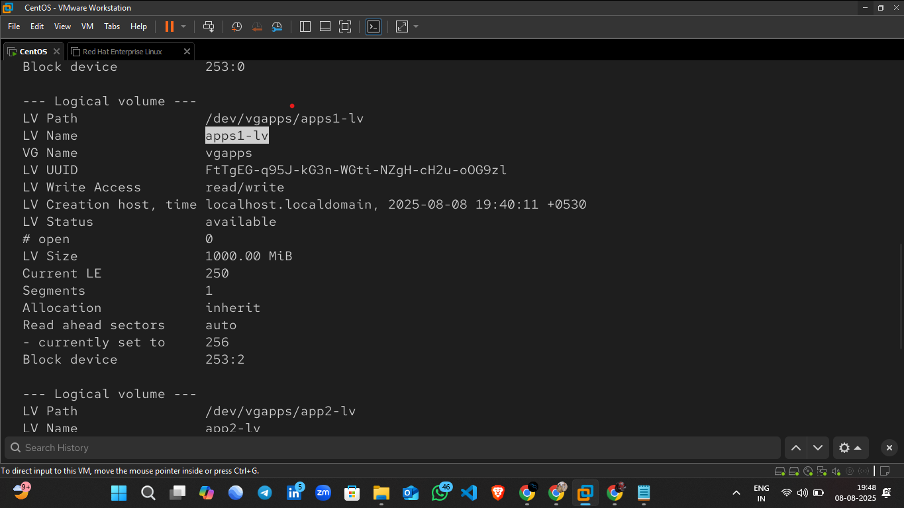

# 🚀 LVM Setup on VirtualBox (RHEL Linux)

[]()
[]()

---

## 📋 Table of Contents
- [About This Task](#about-this-task)
- [Step 1 – Add New Hard Disk in VirtualBox](#step-1--add-new-hard-disk-in-virtualbox)
- [📸 Screenshots & GIF](#-screenshots--gif)
- [Next Steps](#next-steps)

---

## 📖 About This Task
This is the **first step** in setting up **LVM** on a RHEL Linux VM.  
Here, we will add a **new virtual hard disk** in VirtualBox which will later be used to create a Physical Volume (PV) for LVM.

---

## 🛠️ Step 1 – Add New Hard Disk in VirtualBox

1. **Open VirtualBox**  
   Launch VirtualBox on your host system.

2. **Select Your RHEL VM**  
   Click on the VM where you want to add the disk.

3. **Go to Settings**  
   Click the ⚙️ **Settings** icon or right-click → **Settings**.

4. **Open the Storage Tab**  
   From the left panel, select **Storage**.

5. **Select Controller: SATA**  
   Under **Controller: SATA**, click the small **Add Hard Disk** icon (💿 + ➕).

6. **Choose “Add New Attachment”**  
   From the menu, select **Hard Disk**.

7. **Create a New Hard Disk**  
   Click **Create New Disk** → Click **Next**.

8. **Specify Disk Size**  
   Enter the desired size (e.g., `2 GB`) → Click **Create**.

---

## 📸 Screenshots & GIF

> 💡 Add your screenshots and GIF here

1. **VM Storage Settings**  
   

2. **Disk Creation Wizard**  
   

3. **Animated GIF of the Process**  
   
   
   
   
   
   
---

## ⏭️ Next Steps
- Detect the newly added disk inside RHEL (`lsblk`)
- Create **Physical Volume → Volume Group → Logical Volume**
- Create a filesystem and mount it

---


# Partition Creation Using `fdisk`

This document describes the steps to create a partition using the `fdisk` utility in Linux.

## Step 1: Check the Disk
```bash
fdisk /dev/sdb
```
**Output:**
```
Welcome to fdisk (util-linux 2.40.2).
Changes will remain in memory only, until you decide to write them.
Be careful before using the write command.

Device does not contain a recognized partition table.
Created a new DOS (MBR) disklabel with disk identifier 0x34cebb40.
```


---

## Step : View Help Menu
Type `m` inside `fdisk` to see the available commands and their descriptions.
```bash
Command (m for help): m
```
This displays the full help menu for `fdisk`.


---

## Step : Create a New Partition
Since we need a **primary** partition, type `n` and select the **primary** option when prompted.
```bash
Command (m for help): n
Partition type
   p   primary (0 primary, 0 extended, 4 free)
   e   extended (container for logical partitions)
Select (default p): p
Partition number (1-4, default 1):
First sector (2048-4194303, default 2048):
Last sector, +/-sectors or +/-size{K,M,G,T,P} (2048-4194303, default 4194303):
```
This creates a new primary partition of size **2 GiB**.


---

## Step : Change Partition Type to LVM
By default, the partition type is `Linux`. To change it to **Linux LVM**, press `t`:
```bash
Command (m for help): t
Selected partition 1
Hex code or alias (type L to list all):
```
Type `L` to list all types and find **Linux LVM** (`8e`).
```bash
Hex code or alias (type L to list all): 8e
Changed type of partition 'Linux' to 'Linux LVM'.
```


---

## Step : Save and Exit
Type `w` to write the changes to disk and exit:
```bash
Command (m for help): w
```


---

## Step : Verify the Partition
Run:
```bash
fdisk -l
```
**Output:**
```
Disk /dev/sdb: 2 GiB, 2147483648 bytes, 4194304 sectors
Disk model: VMware Virtual S
Units: sectors of 1 * 512 = 512 bytes
Sector size (logical/physical): 512 bytes / 512 bytes
I/O size (minimum/optimal): 512 bytes / 512 bytes
Disklabel type: dos
Disk identifier: 0xe635c378

Device     Boot Start     End Sectors Size Id Type
/dev/sdb1        2048 4194303 4192256   2G 8e Linux LVM
```


---

**✅ Summary:**  
We successfully created a **2 GiB primary partition** on `/dev/sdb`, changed its type to **Linux LVM**, and verified it.

# Creating a Physical Volume (PV) and Volume Group (VG) in LVM

This guide describes how to convert an existing partition into a Physical Volume (PV) and then create a Volume Group (VG) for use with LVM.

---

## Step 1: Create Physical Volume (PV)
Once the partition (`/dev/sdb1`) is ready, initialize it as a Physical Volume so that it can be used by LVM as storage capacity.

**Command:**
```bash
pvcreate /dev/sdb1
```
**Output:**
```
Physical volume "/dev/sdb1" successfully created.
```


---

## Step 2: Display Physical Volume Details
To check details of the created Physical Volume:
```bash
pvdisplay /dev/sdb1
```
**Example Output:**
```
"/dev/sdb1" is a new physical volume of "<2.00 GiB"
--- NEW Physical volume ---
PV Name               /dev/sdb1
VG Name               
PV Size               <2.00 GiB
Allocatable           NO
PE Size               0   
Total PE              0
Free PE               0
Allocated PE          0
PV UUID               GvYnc7-CcoK-ldFD-UOZT-MC0N-YiOm-TSdfGb
```


---

## Step 3: Create a Volume Group (VG)
Create a new Volume Group named `vgapps` using the Physical Volume `/dev/sdb1`.

**Command:**
```bash
vgcreate vgapps /dev/sdb1
```
**Output:**
```
Volume group "vgapps" successfully created
```


---

## Step 4: Display Volume Group Details
To verify and view details of the newly created Volume Group:
```bash
vgdisplay vgapps
```
**Example Output:**
```
--- Volume group ---
VG Name               vgapps
System ID             
Format                lvm2
Metadata Areas        1
Metadata Sequence No  1
VG Access             read/write
VG Status             resizable
MAX LV                0
Cur LV                0
Open LV               0
Max PV                0
Cur PV                1
Act PV                1
VG Size               <2.00 GiB
PE Size               4.00 MiB
Total PE              511
Alloc PE / Size       0 / 0   
Free  PE / Size       511 / <2.00 GiB
VG UUID               Qs9FVW-Q3Z9-cbWw-vLeA-f43X-hxl3-2Pn7QW
```


---

**✅ Summary:**  
- Converted `/dev/sdb1` into a Physical Volume.  
- Created a Volume Group named `vgapps`.  
- Verified details of both PV and VG using `pvdisplay` and `vgdisplay`.
# Creating Logical Volumes (LV), Formatting with EXT4, and Preparing for Mount

This guide describes the steps to create Logical Volumes (LV) inside an existing Volume Group (VG), format them with the EXT4 filesystem, and prepare them for mounting.

---

## Step 1: Create the First Logical Volume

We create a Logical Volume named `apps1-lv` with a size of **1000MB** in the Volume Group `vgapps`.

**Command:**
```bash
lvcreate -L 1000M -n apps1-lv vgapps
```

Verify the LV creation:
```bash
lvdisplay
```
**Example Output:**
```
--- Logical volume ---
LV Path                /dev/vgapps/apps1-lv
LV Name                apps1-lv
VG Name                vgapps
LV UUID                FtTgEG-q95J-kG3n-WGti-NZgH-cH2u-oOG9zl
LV Write Access        read/write
LV Creation host, time localhost.localdomain, 2025-08-08 19:40:11 +0530
LV Status              available
# open                 0
LV Size                1000.00 MiB
Current LE             250
Segments               1
Allocation             inherit
Read ahead sectors     auto
- currently set to     256
Block device           253:2
```


---

## Step 2: Create the Second Logical Volume

Now create another Logical Volume named `app2-lv` with a size of **1000MB** in the same Volume Group.

**Command:**
```bash
lvcreate -L 1000M -n app2-lv vgapps
```
**Output:**
```
Logical volume "app2-lv" created.
```

Verify again:
```bash
lvdisplay
```
**Example Output:**
```
--- Logical volume ---
LV Path                /dev/vgapps/app2-lv
LV Name                app2-lv
VG Name                vgapps
LV UUID                tXAX0e-8MLs-DXOH-rhdu-9e5s-q3oH-AKT8H1
LV Write Access        read/write
LV Creation host, time localhost.localdomain, 2025-08-08 19:44:51 +0530
LV Status              available
# open                 0
LV Size                1000.00 MiB
Current LE             250
Segments               1
Allocation             inherit
Read ahead sectors     auto
- currently set to     256
Block device           253:3
```


---

## Step 3: Format the First Logical Volume with EXT4

We will now format `apps1-lv` with the EXT4 filesystem.

**Command:**
```bash
mkfs.ext4 /dev/vgapps/apps1-lv
```

**Explanation:**
- `mkfs` = Make File System
- `ext4` = Modern journaling file system for Linux
- `/dev/vgapps/apps1-lv` = Path to the logical volume
- This will erase existing data and prepare the LV for mounting.

**Example Output:**
```
mke2fs 1.47.1 (20-May-2024)
Creating filesystem with 256000 4k blocks and 64000 inodes
Filesystem UUID: 432d54b7-4672-4983-a264-885d6760eef1
Superblock backups stored on blocks:
    32768, 98304, 163840, 229376

Allocating group tables: done
Writing inode tables: done
Creating journal (4096 blocks): done
Writing superblocks and filesystem accounting information: done
```


---

## Step 4: Format the Second Logical Volume with EXT4

Format `app2-lv` with the EXT4 filesystem.

**Command:**
```bash
mkfs.ext4 /dev/vgapps/app2-lv
```

**Example Output:**
```
mke2fs 1.47.1 (20-May-2024)
Creating filesystem with 256000 4k blocks and 64000 inodes
Filesystem UUID: 047e5605-2c4f-4e8e-9695-cf92b33d7a02
Superblock backups stored on blocks:
    32768, 98304, 163840, 229376

Allocating group tables: done
Writing inode tables: done
Creating journal (4096 blocks): done
Writing superblocks and filesystem accounting information: done
```


---

**✅ Summary:**
- Created two Logical Volumes: `apps1-lv` and `app2-lv`.
- Formatted both with the EXT4 filesystem.
- Verified creation and formatting with `lvdisplay`.


